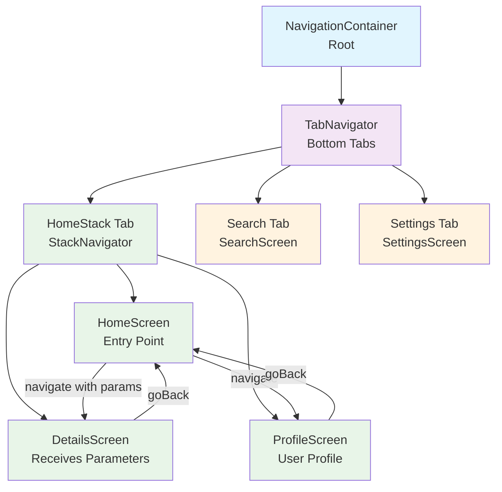

# Navigation Flow Diagram (Mermaid)



## Component Details

### Navigation Structure
- **Root**: NavigationContainer wraps entire app
- **Main**: TabNavigator provides 3 bottom tabs
- **Nested**: StackNavigator within Home tab
- **Screens**: Individual screen components

### Parameter Passing
```javascript
// From HomeScreen to DetailsScreen
navigation.navigate('Details', {
  itemId: 42,
  itemName: 'Sample Item'
});

// In DetailsScreen
const { itemId, itemName } = route.params;
```
